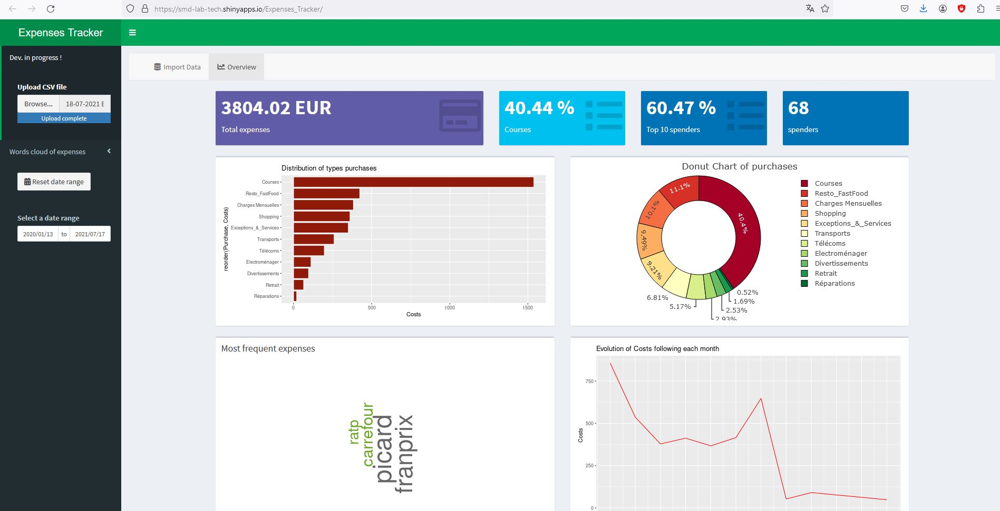

# 💰 Expenses Tracker  


<p align="left"> 
    <a href="https://shiny.posit.co/">
        </img>
    </a>
    <a href="https://smd-lab-tech.shinyapps.io/Expenses_Tracker/">
        </img>
    </a>
</p>  

---

## 📌 Présentation  

**ET_analytics** est une application **RShiny** dédiée au suivi des **dépenses personnelles** et à l'analyse financière.  
L'application permet d'explorer et de **visualiser** ses dépenses avec une **plage de dates interactive**.  

📌 **Technologies utilisées**  
✅ **RShiny** - Développement web interactif  
✅ **JavaScript & CSS** - Interface utilisateur optimisée  
✅ **Time Series Analysis** - Analyse des tendances temporelles  
✅ **NLP & Text Mining** - Analyse de texte et modélisation de sujets  

🔗 **[Démo en ligne](https://smd-lab-tech.shinyapps.io/Expenses_Tracker/)**  
📂 **Charger un dataset test** → *18-07-2021 Expense_Data.csv*  

---

## 📖 Table des matières  
- [💾 Installations](#install)  
- [🚀 Fonctionnalités](#features)  
- [🏆 Sponsors](#sponsors)  

---

<h2 id="install">💾 Installations requises</h2>  

Pour exécuter cette application **en local**, installez les bibliothèques suivantes dans **R** :  

```r
install.packages(c("tidyverse", "tm", "SnowballC", "wordcloud", "gtsummary", "RColorBrewer",
                   "reactable", "kableExtra", "plotly", "data.table", "openxlsx", "sp", "DT",
                   "lubridate", "magrittr", "fpp", "shinydashboard", "shinycssloaders",
                   "shinybusy", "shinyWidgets", "shinythemes", "shinyjs", "shiny"))
```

---

<h2 id="features">🚀 Fonctionnalités</h2>  

📊 **Analyse des dépenses par catégorie**  
📅 **Sélection de périodes dynamiques**  
📈 **Visualisation des tendances temporelles (Time Series Analysis)**  
🗣️ **Analyse des descriptions via NLP (Text Mining & Topic Modeling)**  
📉 **Prédictions et recommandations financières**  

---

<h2 id="sponsors">🏆 Sponsors</h2>  

✨ **Développé par [SMD Lab Tech](https://github.com/smdlabtech)**  
📧 Contact : smdlabtech@gmail.com 

---
 
📜 **Licence** : Open-Source  

> @smdlabtech
---
